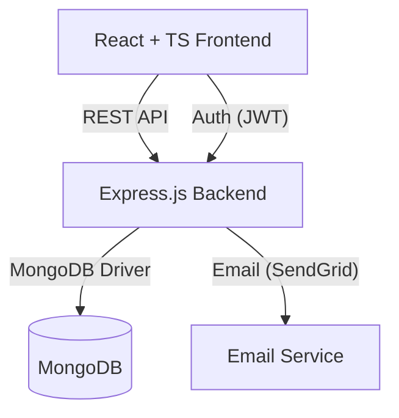
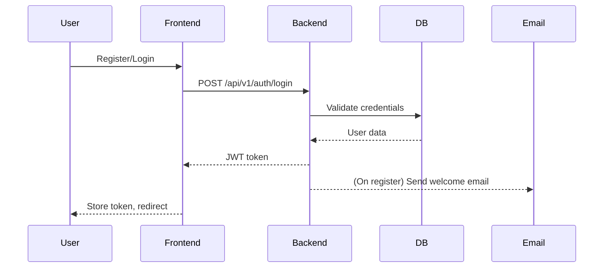
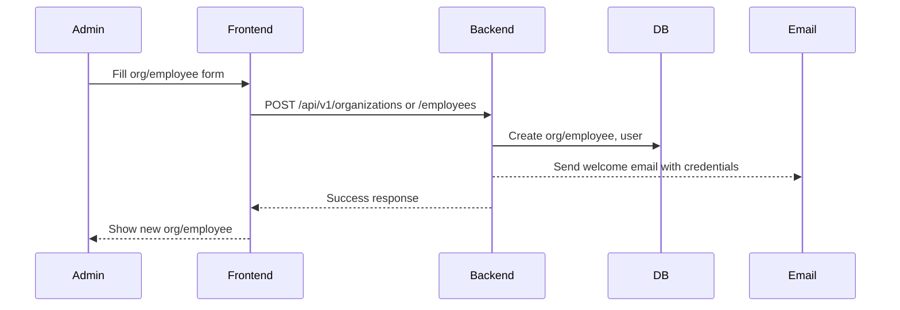

# ERP System

A modern, full-stack ERP (Enterprise Resource Planning) application for managing organizations, employees, attendance, payroll, leave, and more. Built with a React + TypeScript frontend, Node.js/Express backend, and MongoDB database. Includes robust authentication, role-based access, and email notifications via SendGrid.

---

## Features

- Organization and employee management
- Role-based access (super admin, company admin, employee, etc.)
- Attendance, leave, payroll, and document management
- Secure authentication (JWT)
- Welcome emails with credentials (SendGrid)
- Responsive, modern UI (React, Tailwind CSS)
- RESTful API (Express)

---

## Project Structure

```
ERP/
├── client/           # Legacy React JS client (deprecated)
├── public/           # Static assets, PWA files
├── server/           # Node.js/Express backend
│   ├── controllers/  # Route controllers (auth, email, etc.)
│   ├── middleware/   # Auth, error handling, validation
│   ├── models/       # Mongoose models (User, Employee, etc.)
│   ├── routes/       # API routes (employees, organizations, ...)
│   ├── utils/        # Utility functions (email, notifications)
│   └── server.js     # Main server entry point
├── src/              # Modern React + TypeScript frontend
│   ├── components/   # UI components
│   ├── pages/        # App pages (Dashboard, Employees, ...)
│   ├── services/     # API service layer
│   ├── store/        # Redux store and slices
│   └── ...
├── package.json      # Project metadata
└── README.md         # Project documentation
```

---

## High-Level Architecture



- **Frontend**: React (TypeScript), Redux, Tailwind CSS
- **Backend**: Node.js, Express, Mongoose
- **Database**: MongoDB
- **Email**: SendGrid

---

## Key Diagrams

### 1. User Authentication Flow



### 2. Organization & Employee Creation



---

## Setup & Run

1. **Install dependencies**
   ```sh
   npm install
   cd server && npm install
   cd ../src && npm install
   ```
2. **Configure environment**
   - Copy `.env.example` to `.env` in `server/` and fill in MongoDB, JWT, SendGrid keys.
3. **Start backend**
   ```sh
   cd server
   npm start
   ```
4. **Start frontend**
   ```sh
   cd ..
   npm run dev
   ```

---

## Environment Variables (server/.env)

- `MONGO_URI` - MongoDB connection string
- `JWT_SECRET` - JWT signing key
- `SENDGRID_API_KEY` - SendGrid API key
- `SENDGRID_SENDER` - Verified sender email

---

## License

MIT License

Copyright (c) 2025 Saurabh Pathak

Permission is hereby granted, free of charge, to any person obtaining a copy
of this software and associated documentation files (the "Software"), to deal
in the Software without restriction, including without limitation the rights
to use, copy, modify, merge, publish, distribute, sublicense, and/or sell
copies of the Software, and to permit persons to whom the Software is
furnished to do so, subject to the following conditions:

The above copyright notice and this permission notice shall be included in all
copies or substantial portions of the Software.

THE SOFTWARE IS PROVIDED "AS IS", WITHOUT WARRANTY OF ANY KIND, EXPRESS OR
IMPLIED, INCLUDING BUT NOT LIMITED TO THE WARRANTIES OF MERCHANTABILITY,
FITNESS FOR A PARTICULAR PURPOSE AND NONINFRINGEMENT. IN NO EVENT SHALL THE
AUTHORS OR COPYRIGHT HOLDERS BE LIABLE FOR ANY CLAIM, DAMAGES OR OTHER
LIABILITY, WHETHER IN AN ACTION OF CONTRACT, TORT OR OTHERWISE, ARISING FROM,
OUT OF OR IN CONNECTION WITH THE SOFTWARE OR THE USE OR OTHER DEALINGS IN THE
SOFTWARE.

---

## Authors

- Saurabh Pathak (Software Developer)
- GitHub: [@techsaurabh-394](https://github.com/techsaurabh-394)

---

## Notes

- For production, set up HTTPS, environment variables, and secure MongoDB.
- See code for more details and customization.

---

## How to Change Super Admin Email and Password

The default super admin is seeded via `server/scripts/seedSuperAdmin.js`.

To change the super admin email or password:

1. **Edit the seed script:**
   - Open `server/scripts/seedSuperAdmin.js`.
   - Change the `email` and `password` values as desired.
2. **Re-run the seed script:**
   - In the terminal, run:
     ```sh
     cd server
     node scripts/seedSuperAdmin.js
     ```
   - This will update or create the super admin with the new credentials.

**Note:** If a super admin already exists, the script will update the password for the specified email.
